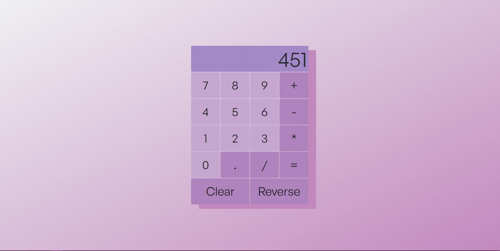

# Calculator

## Overview
Simple calculator app with almost every functionality that a standard calculator provides.

### Screenshot

## The app
Preview it live right here --> https://michaell0.github.io/Simple-Calculator/

### Built with
-Semantic HTML5 markup
-CSS and Flexbox
-Javascript

### What I learned and the experience
I won't lie this was really tough in some ways. By far the hardest part was to figure out the calculator logic and chained calculations that are evaluated only one at a time. This part took me some time to crack, cause I didn't want to get any help and I wanted to come up with a solution all by myself just to test my abilities. I did it although it took some time, but was definitely worth it in the end.

Learned so much. Got better with Flexbox and how to do responsive things and how to correctly layout things so it's not such a problem later to add some new things. The JS itself in the end there is nothing complicated in my code, as I said the logic was the hardest to figure out. By far the best thing that I learned is how to solve problems and how to "think like a programmer". Always tried to understand what was the problem and inspect it step by step, plan my solution on paper or in comments and try to divide it into smaller problems and not try to solve the big problem but rather to solve smaller problems that make up the big one. Learned that redoing some parts is better than staring at the code for long time and doing nothing. If something isn't working, try to look at it from a different perspective and redo it from that perspective.

There were times when my psycha was sitting. It was fucking exhausting, it really was giving me doubt if I can be a real programmer and get a job in the future. "I am fucking dumb and I won't be a real programmer ever if I can't even do a simple fucking calculator", I often thought. But am proud of myself. I know that it all sounds so dumb, cause it's just a calculator haha. 
